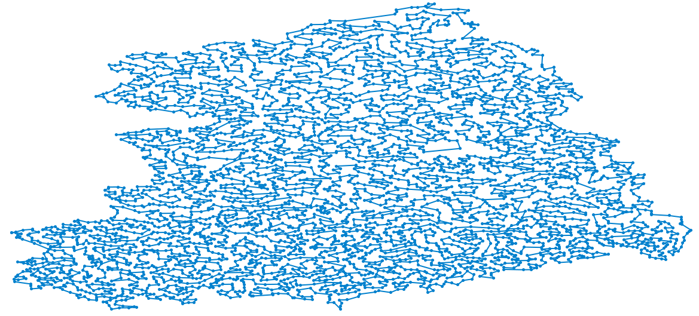
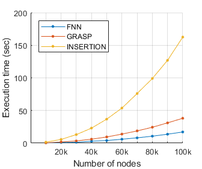
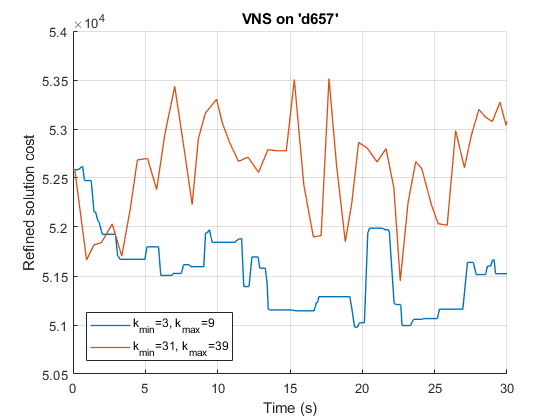
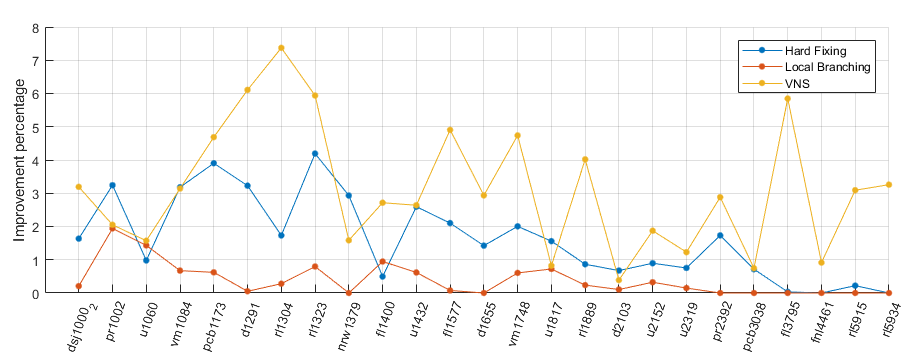

# Euclidean TSP Solver
This project provides several methods to find the optimum or approximate an Euclidean instance of the **Travelling Salesman Problem**.
It is meant to read instances in the [TSPLIB](http://comopt.ifi.uni-heidelberg.de/software/TSPLIB95/STSP.html) format, instantiate
a _Mixed-Integer Program_, solving it with the IBM ILOG **CPLEX libraries** or build and optimize it with **heuristic** and 
**metaheuristic algorithms** implemented from scratch.

The final solution can be automatically displayed using [GNUPLOT](http://www.gnuplot.info/) at the end of the execution.

</img>  
  
_Instance "fnl4461" from TSPLIB with 4461 cities. Approximated with a 7.8%-gap from the optimum, obtained in only 3.8 seconds using
FNN + 2opt greedy refiner._

## Introduction and motivation
The techniques in this project can be basically split in _exact_ and _approximated_.
Finding the true optimal solution is very expensive and linear models such as MTZ and GG can be used only for small instances of just a few hundred nodes.
In the case of larger instances and time limitations, the analyst is compelled to use approximate methods.
Having an hypothetical infinite amount of time at our disposal still does not gives an easy scenario:
tackling a large problem with an exact solver requires having a huge memory, making it impossible for most computers.
Constructive and metaheuristics approaches, on the other hand, do not require much resources and a first approximation can be obtained even with a single
household computer.

## Implemented methods
</img>
#### MIP formulations and Lazy callbacks methods
- **DFJ** : Dantzig-Fulkerson-Johnson (1954)
- **MTZ** : Miller-Tucker-Zemlin (1960)
- **GG** : Gavish-Graves (1978), also known as _Flow-one_
- **Lazy Cut Callbacks** : The main idea is to integrate the constraint addition phase into the CPLEX process, rather than repeatedly calling the solver and changing its input model.
With IBM ILOG CPLEX 12.10.0 it is possible to install a user-defined routine that comes into play only when strictly necessary,
that is, when an update of the incumbed solution occurs, in order to cut all the subtours.
#### Heuristics
- **Hard Fixing** : Given an initial non-optimal solution, iteratively, a certain amount of arcs are fixed the current solution and then the solver is re-activated.
In this way the problem submitted to the solver is smaller than the original one, and consequently it is more manageable.
- **Local Branching** : Given an initial non-optimal solution, a new constraint is added to the model: the user decides how many arcs to fix,
whereas choosing _which ones_ is up to the solver.
#### Constructive heuristics

</img>

- **First Nearest Neighbor (FNN)** : A tour is constructed starting from a random node and iteratively connecting the latest to the nearest node that has not been added yet.
- **GRASP** : A tour is contructed as in FNN, but the choice of the next node is randomized according to an arbitrary probability distribution.
- **Insertion method** : At every iteration, a random 2-node-tour tour is enriched with a new node, through the removal of an edge and the insertion of the node by adding two new edges. The next node to be inserted is randomly selected but the arcs to be modified are choosen in order to minimize the cost of insertion.

#### k-opt Refiners
- **2-opt refiner** : The algorithm searches for every possible pair of arcs to be crossed in order to reduce the tour cost, it crosses the pair that gives
the best improvement and repeats the whole process.
- **2-opt greedy refiner** : As the previous one, but crosses are applied as soon as an improving one is found.
- **3-opt greedy refiner** : As the previous one, but it searches for triplets of arcs instead of pairs.
#### Metaheuristics
</img>
- **Variable Neighboorhood Search (VNS)** : An initial solution is diversificated and then refined until the suite of algorithms implemented are no longer able to improve its cost. The process is then
reated and chances are that the final algorithm will jump out of the local minima in which a limited-range neighborhood search would stagnate.
- **Simulated Annealing** : A physics-inspired metaheuristic. The random solution is perturbed millions of times: positive improvements are always accepted whereas the negative
ones are accepted only with a small probability.

## Results
Let us summarize the most important results: First Nearest Neighbor (FNN) is able to provide a first solution in less than 20 seconds even for problem of
up to 100 thousand nodes and achieve 20% of approximation gap on average for the medium-sized ones, lowering down to (1%;9%) with an additional
refinement procedure.
Simulated Annealing does not require any intuition on the problem itself but the time needed grows with the instance size and
it reaches a plateau after a while.
Variable Neighborhood Search (VNS) gave us better accuracy performance than Hard Fixing and Local Branching improving the incumbent solution by a
factor of 3.15%, as opposed to 1.64% and 0.39% of the other approaches.

</img>

_How much can these methods improve an initial solution obtained with FNN + 2opt refining? VNS leads to the highest average improvement in 1 hour of computation._

Based on all the experiments done in this project, we state that the successive steps of generating an initial solution with
First Nearest Neighbor, refining it with a 2-opt greedy refiner and then applying VNS leads to **the best approach** in terms of achievable accuracy,
computational resources needed and implementation flexibility.
